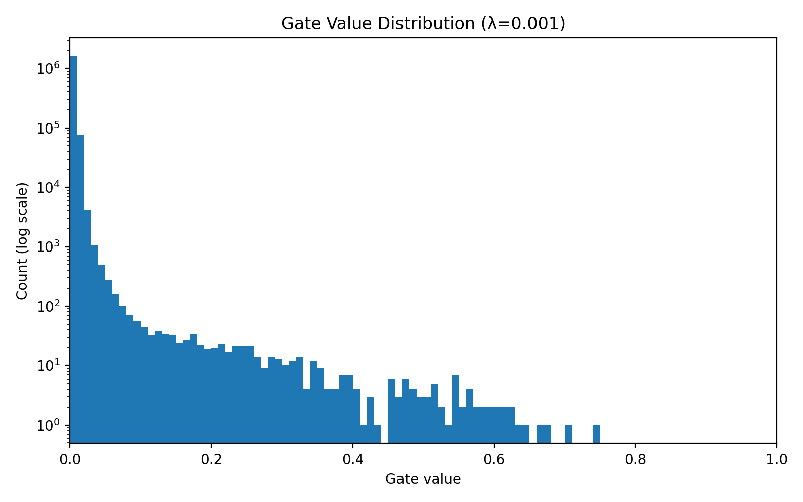

# Self-Pruning Neural Network

## Overview
This project implements a self-pruning neural network using learnable sigmoid gates. Each weight is controlled by a gate, and L1 regularization encourages sparsity during training.

## Features
- Custom PrunableLinear layer
- Learnable gating mechanism
- L1 sparsity regularization
- CIFAR-10 training
- Sparsity vs accuracy analysis

## Results

| Lambda | Test Accuracy (%) | Sparsity (%) |
|--------|------------------|-------------|
| 1e-5   | 55.19            | 1.89        |
| 1e-3   | 51.20            | 95.12       |
| 1e-1   | 34.39            | 99.99       |

## Plot


## How to Run

```bash
pip install -r requirements.txt
python prunable_network.py
